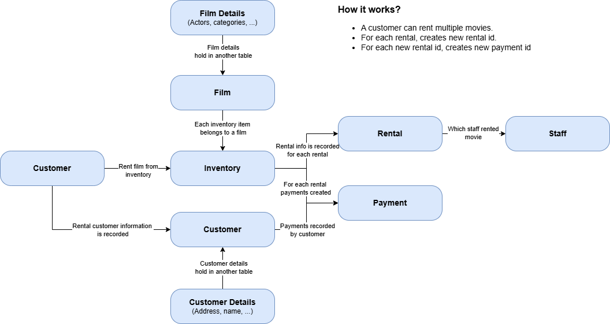
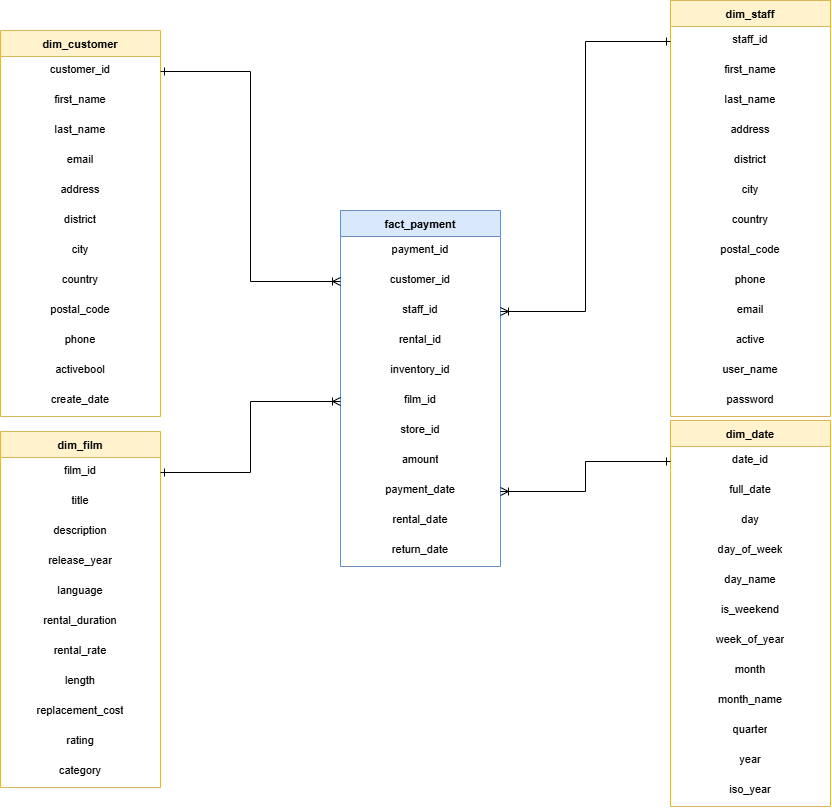
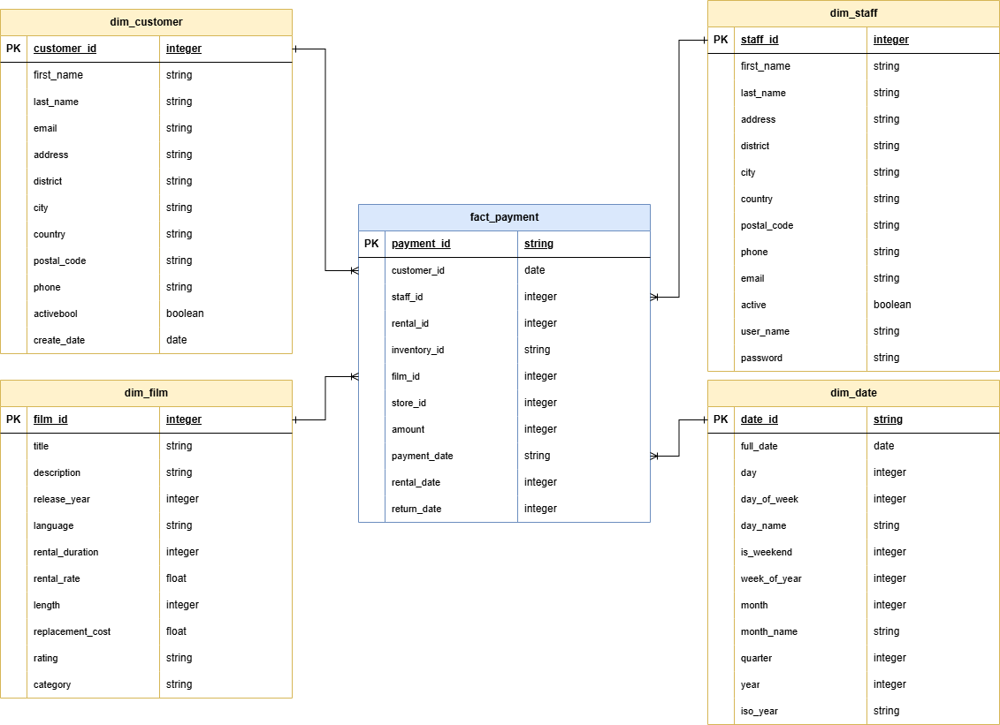

# **About Project**

Since it is difficult for teams to make data-driven decisions, understand data and table relationships and create reports through OLTP, it was decided to build a data warehouse using dimensional data modeling for the marketing, sales and customer relations departments that applied to the data team.

For this purpose, the following gains will be achieved:
        
- **Customers rental behavior**,
- **Staff and stores performances**,
- **Data-driven understanding of movie preference**.

## Notes

- I've used, Airflow 3. So there might be few differences from previous versions.

- If you get confused about where tables coming from, you can check data_mapping excel file.

- Sakila database was used. You can check it from; https://dev.mysql.com/doc/sakila/en/

## Data Modelling Phases:

    - Conceptual Modelling:

    I've tried to demonstrate what we do in real life with conceptual model. It's basically understanding what business asks from us as data engineers.
    There is basic conceptual model, for our imaginary business request. It shows, how business related to our real database but in a way that everyone can understand. Not deep technical terms used, its very basic.

    
        
    - Logical Modelling:

    Here we're demonstrating, how it looks like in reality. Again, in a way that everyone can understand but few technical terms are used. Like, dependencies, relations and keys (primary, foreign).

    

    - Physical Modelling:

    Physical modelling phase shows us, real application. It's a set of collection of conceptual and logical modelling. So think like you have created a blueprint with conceptual and logical modelling phase, and here you are showing real application how looks like. After this, you'll apply with physical modelling.

    

### ELT Process

    - OLTP(PostgreSQL) → Staging(PostgreSQL) → DWH(BigQuery)

### Technologies Used

    - Python, Airflow, BigQuery, PostgreSQL